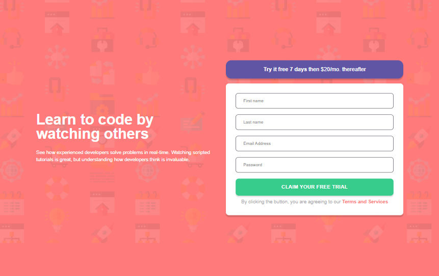

# Frontend Mentor - Intro component with sign up form solution

This is a solution to the [Intro component with sign up form challenge on Frontend Mentor](https://www.frontendmentor.io/challenges/intro-component-with-signup-form-5cf91bd49edda32581d28fd1). Frontend Mentor challenges help you improve your coding skills by building realistic projects.

## Table of contents

- [Overview](#overview)
  - [The challenge](#the-challenge)
  - [Screenshot](#screenshot)
  - [Links](#links)
  - [Built with](#built-with)
  - [What I learned](#what-i-learned)
  - [Continued development](#continued-development)
  - [Useful resources](#useful-resources)
- [Author](#author)
- [Acknowledgments](#acknowledgments)

## Overview

### The challenge

Users should be able to:

- View the optimal layout for the site depending on their device's screen size
- See hover states for all interactive elements on the page
- Receive an error message when the `form` is submitted if:
  - Any `input` field is empty. The message for this error should say _"[Field Name] cannot be empty"_
  - The email address is not formatted correctly (i.e. a correct email address should have this structure: `name@host.tld`). The message for this error should say _"Looks like this is not an email"_

### Screenshot

### Links

<!-- - Solution URL: [Add solution URL here](https://your-solution-url.com) -->

- [live site URL](https://intro-component-with-signup-form-chi-ten.vercel.app/)

### Built with

- Semantic HTML5 markup
- CSS custom properties
- Flexbox
- CSS Grid
- [React](https://reactjs.org/) - JS library
- [Tailwindcss](https://tailwindcss.com/) - CSS framework
- [Shadcn](https://ui.shadcn.com) - Custom React component
- [Zod](https://zod.dev/) - Email validator library
- [Lucide](https://lucide.dev/) - Icons library

**Note: These are just examples. Delete this note and replace the list above with your own choices**

### What I learned

This challenge doesn’t even look hard, but the way I solved it was really weird. I’m excited and I feel weird at the same time for relying so much on external help.

On top of that, I learned not to compare my day 7 (yes, it’s only been a week since I started learning React) to someone else’s day 100.

### Continued development

- useState()
- customizable react component
- Problem solving techniques

### Useful resources

- [Shadcn](https://ui.shadcn.com/) - This collection of re-usable, customizable React components gave another dimension to my work
- [Lucide.dev](https://lucide.dev/) - out of a joke my friend turned a simple button to an animated component really cool
- [Zod](https://zod.dev/) - Great library, it helped my understand email validator

## Author

- Frontend Mentor - [@jeanclaude09-dev](https://www.frontendmentor.io/profile/jeanclaude09-dev)
- Twitter - [@iamjeanclaude09](https://www.twitter.com/iamjeanclaude09)
- Github - [@jeanclaude09-dev](https://github.com/Jeanclaude09-dev)

## Acknowledgments

Many thanks to [parfaitBashombe](https://github.com/parfaitBashombe) 👌
He helped me a lot in this challenge and I learned a lot
